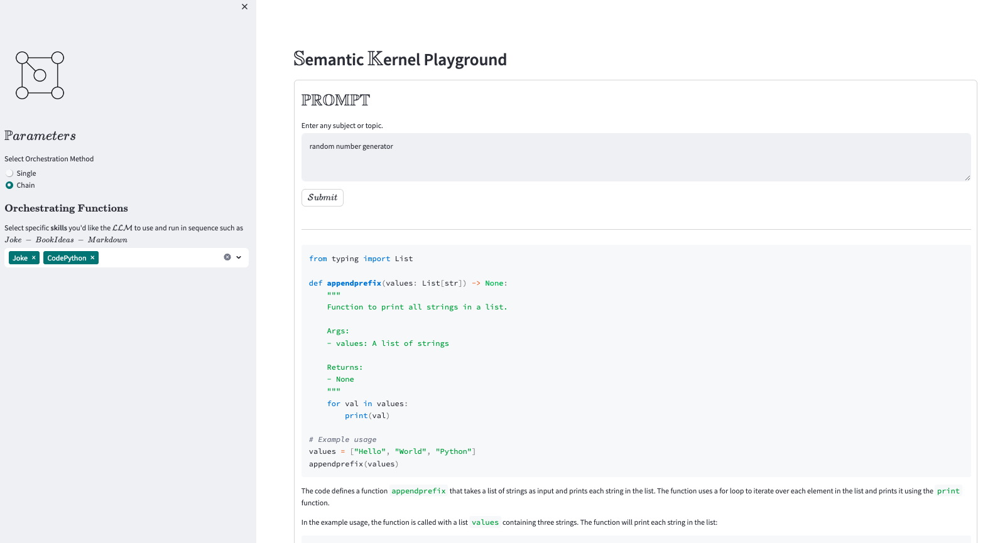

# Semantic functions playground

A Streamlit based playground for trying out single and multi-skill orchestration with [Microsoft Semantic Kernel](https://learn.microsoft.com/en-us/semantic-kernel/overview/). Over 60+ semantic functions.

Semantic Kernel is an open-source SDK that lets you easily combine AI services like OpenAI, Azure OpenAI, and Hugging Face with conventional programming languages like C# and Python. By doing so, you can create AI apps that combine the best of both worlds.

Per the website.


## References

[MS Docs](https://learn.microsoft.com/en-us/semantic-kernel/overview/)

[Project Miyagi](https://github.com/Azure-Samples/miyagi)

## How to use

1. Clone the repo and set environment variables in `.env`. 
   ```yml
   OPENAI_API_KEY=
   ```
2. Create and activate python environment
   ```sh
   conda env create -f environment.yml
   conda activate SEM_KRNL
   ```

3. Run the app
   ```sh
   streamlit run main.py
   ```

## Skills List

Skills can be used `invidually` or `chained` with multiple skills in sequential mode with final output depending on the `last` skill selected.

```yml
0	Importance
1	Question
2	Entity
3	CommandLinePython
4	Code
5	EmailSearch
6	DOSScript
7	CodePython
8	AssistantShowCalendarEvents
9	AssistantIntent
10	Joke
11	Limerick
12	Excuses
13	NovelChapter
14	TwoSentenceSummary
15	StoryGen
16	EnglishImprover
17	Rewrite
18	Brainstorm
19	Translate
20	NovelChapterWithNotes
21	AcronymGenerator
22	EmailGen
23	Acronym
24	ShortPoem
25	EmailTo
26	NovelOutline
27	TellMeMore
28	AcronymReverse
29	ElementAtIndex
30	Continue
31	BookIdeas
32	CreateBook
33	Chat
34	ChatFilter
35	ChatV2
36	ChatGPT
37	ChatUser
38	MakeAbstractReadable
39	Summarize
40	Topics
41	Notegen
42	ExciseEntities
43	ExtractEntities
44	ReferenceCheckEntities
45	Form
46	GitHubMemoryQuery
47	AssistantResults
48	Question
49	ContextQuery
50	QNA
```

## Screenshots

### Single Skill Inference


### Multi Skill Inference



